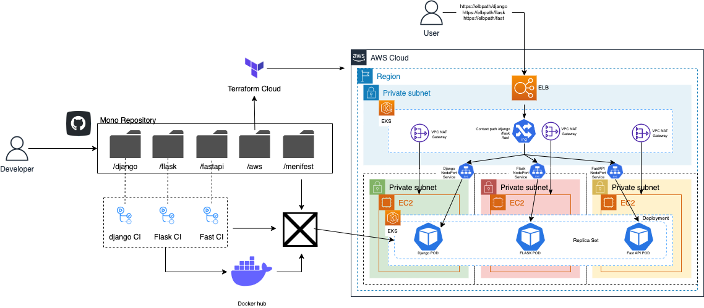

# msa-architecture
msa Training cluster by python based language's server library for studying msa , ArgoCD , K8s , EFK 


### ⚠️ Please Read me

main.tf
```tf
terraform {
  backend "remote" {
    organization = "codns" # must be changed
    workspaces {
      name = "msa_kube" # must be changed
    }
  }
  ...
 ```
 
